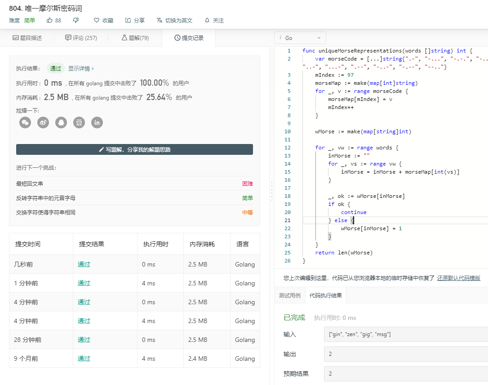
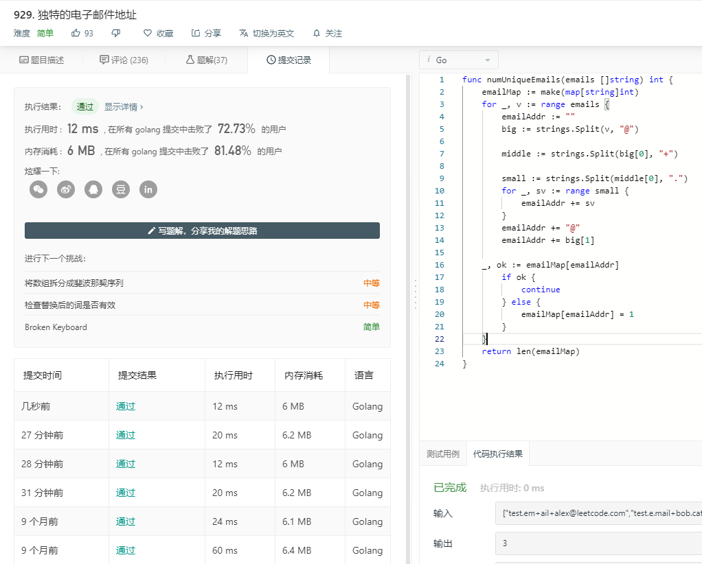
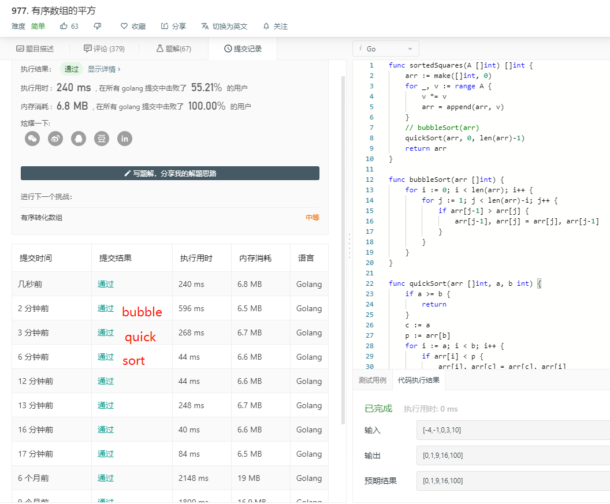
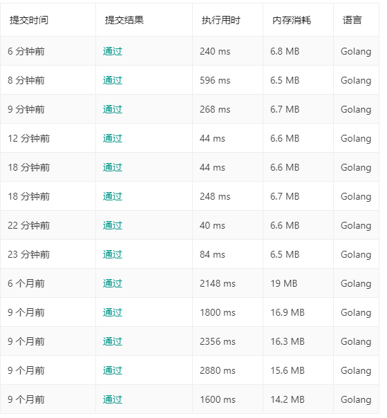

# 本周题解

## 709

### 解题思路

​	利用ASCII码规则大写字母比小写字母小**32**，把范围为(64,91)的元素加32得到它的小写。

> 可通过命令查看ASCII码
>
> ```bash
> man ascii
> ```

### 代码

#### 709.go

```go
func toLowerCase(str string) string {
	lstr := ""
    for _, v := range str {
		if v < 91 && v > 64{
			v += 32
		}
		lstr = lstr + string(v)
	}
	return lstr
} 
```

### 结果快照


## 771 

### 解题思路

​	两个for循环，遍历宝石数组和石头数组，石头数组的值与宝石数组的值相等，宝石数量加一。

### 代码

#### 771.go

```go
func numJewelsInStones(J string, S string) int {
	jSum := 0
	for _, j := range J {
		for _, s := range S {
			if j == s {
				jSum++
			}
		}
	}
	return jSum
}
```

### 结果快照


## 804

### 解题思路

​	分两步处理，利用两个map。第一步先把单词翻译成摩斯密码，第二步看看有多少种不一样的摩斯密码。写的时候比较懒，直接拷贝了题中的摩斯密码放在数组里，然后转成map。

###  代码

#### 804.go

```go
func uniqueMorseRepresentations(words []string) int {
	var morseCode = [...]string{".-", "-...", "-.-.", "-..", ".", "..-.", "--.", "....", "..", ".---", "-.-", ".-..", "--", "-.", "---", ".--.", "--.-", ".-.", "...", "-", "..-", "...-", ".--", "-..-", "-.--", "--.."}
	mIndex := 97
	morseMap := make(map[int]string)
	for _, v := range morseCode {
		morseMap[mIndex] = v
		mIndex++
	}

	wMorse := make(map[string]int)

	for _, vw := range words {
		inMorse := ""
		for _, vs := range vw {
			inMorse = inMorse + morseMap[int(vs)]
		}

        _, ok := wMorse[inMorse]
        if ok {
            continue
        } else {
            wMorse[inMorse] = 1
        }
	}
	return len(wMorse)
}
```

### 结果快照



## 929

### 解题思路 

​	这是一个string分割的题目。

​	解法一（**929.go**）比较直接，遍历邮件地址，遇到”**.**“(46)就忽略；遇到”**+**“(43)就把**meetPlus**置为true，忽略此后遇到的每一个字符——直到遇到”**@**“(64)；遇到”**@**“(64)之后把**meetAt**置为true，保存此后的每一个字，然后写入map，最后给出map的长度。

​	解法二（**929_1.go**）是直接分割邮件地址，先根据”**@**“把邮件地址一分为二生成”**big**"，再根据”**+**“把**big[0]**一分为二生成“**middle**”，再把**middle[0]**根据“**.**"进行分割生成“**small**"，然后拼接**small[...]**+**big[1]**，同样写入map，最后给出map的长度。

> 解法二（12ms）要比一（20ms）快不少，内存占用也小一点。

### 代码

#### 929.go

```go
func numUniqueEmails(emails []string) int {
    emailMap := make(map[string]int)
	for _, v := range emails {
		meetAt := false
		meetPlus := false
		emailAddr := ""
		for _, ev := range v {
			if meetAt {
				emailAddr += string(ev)
			} else {
				if ev == 64 {
					emailAddr += string(ev)
					meetAt = true
					continue
				}
				if meetPlus {
					continue
				} else {
					if ev == 43 {
						meetPlus = true
						continue
					}
					if ev == 46 {
						continue
					}
					emailAddr += string(ev)
				}
			}
		}

        _, ok := emailMap[emailAddr]
        if ok {
            continue
        } else {
            emailMap[emailAddr] = 1
        }
	}
	return len(emailMap)
}
```

#### 929_1.go

```go
func numUniqueEmails(emails []string) int {
	emailMap := make(map[string]int)
	for _, v := range emails {
		emailAddr := ""
		big := strings.Split(v, "@")
		
		middle := strings.Split(big[0], "+")
		
		small := strings.Split(middle[0], ".")
		for _, sv := range small {
			emailAddr += sv
		}
		emailAddr += "@"
		emailAddr += big[1]
		
	_, ok := emailMap[emailAddr]
        if ok {
            continue
        } else {
            emailMap[emailAddr] = 1
        }
	}
	return len(emailMap)
}
```

### 结果快照




## 977

### 解题思路

​	使用了先算出平方值再排序的办法。**977.go**直接用了”sort“包的排序方法，**977_1.go**自己写了两个简单的排序——冒泡和快速。

### 代码

#### 977.go

```go
func sortedSquares(A []int) []int {
	arr := make([]int, 0)
	for _, v := range A {
		v *= v
		arr = append(arr, v)
	}
	sort.Ints(arr)
	
    return arr
}
```

#### 977_1.go

```go
func sortedSquares(A []int) []int {
	arr := make([]int, 0)
	for _, v := range A {
		v *= v
		arr = append(arr, v)
	}
	// bubbleSort(arr)
	quickSort(arr, 0, len(arr)-1)
	return arr
}

func bubbleSort(arr []int) {
	for i := 0; i < len(arr); i++ {
		for j := 1; j < len(arr)-i; j++ {
			if arr[j-1] > arr[j] {
				arr[j-1], arr[j] = arr[j], arr[j-1]
			}
		}
	}
}

func quickSort(arr []int, a, b int) {
	if a >= b {
		return
	}
	c := a
	p := arr[b]
	for i := a; i < b; i++ {
		if arr[i] < p {
			arr[i], arr[c] = arr[c], arr[i]
			c++
		}
	}
	arr[c], arr[b] = arr[b], arr[c]
	quickSort(arr, a, c-1)
	quickSort(arr, c+1, b)
}
```

### 结果快照

> 可以看到用**sort**包最快，其次是快速排序，最差是冒泡排序。有趣的地方在于，无论哪一种都比六（九）个月前快了很多，内存占用也减少了。可能和Golang（最后一次测试基于1.10.3）版本升级或者是他们的服务器硬件升级有关。







