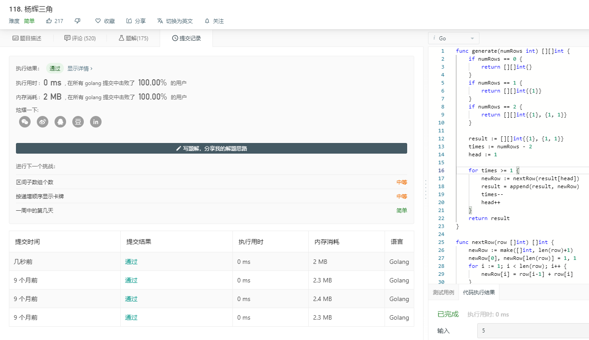
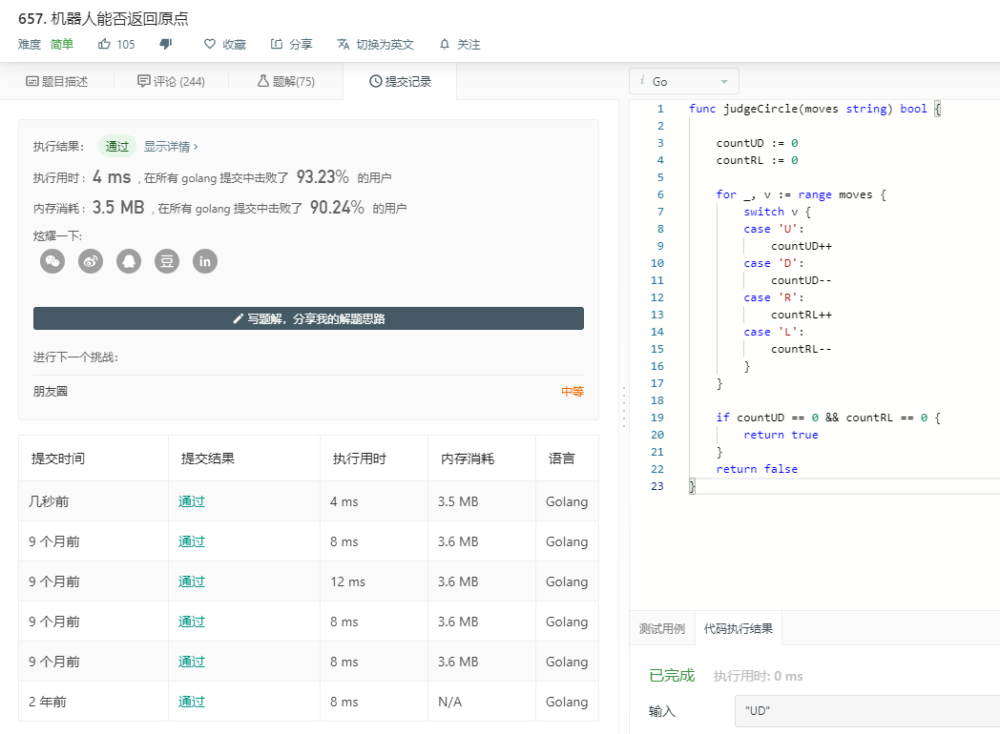
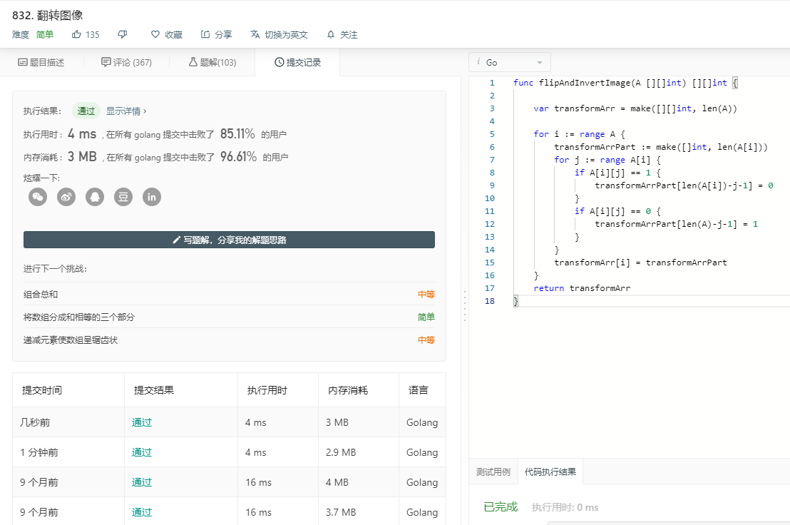
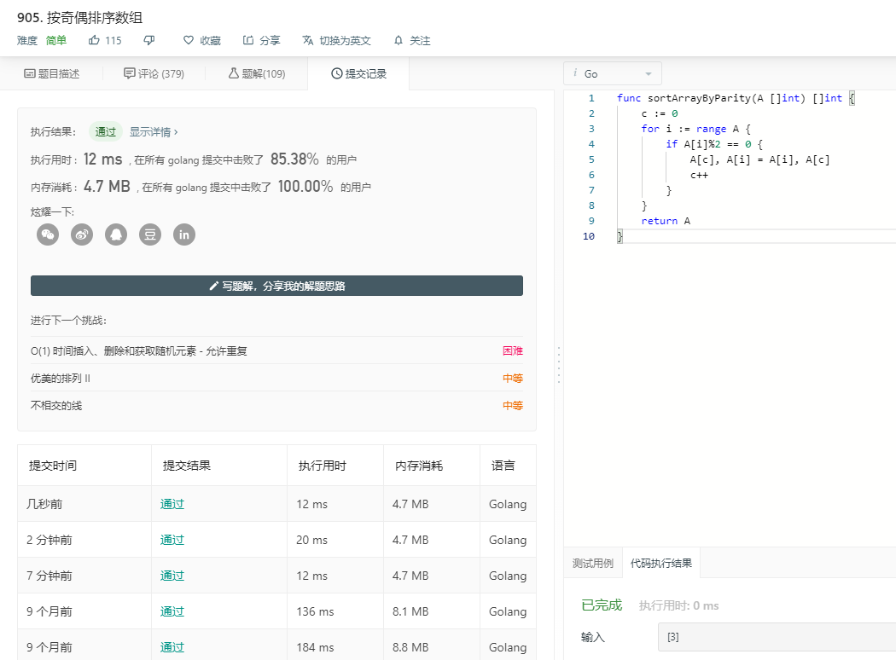

# 本周题解

## 118

### 解题思路

​	直接写出输入为0，1，2行的结果。从第3行开始的任意一行n，先生成头（n[0]）尾（n[n]）两个”1“，中间的数字[1,n-1]由上一行的相邻两个数字相加得到。

### 代码

#### 118.go

```go
func generate(numRows int) [][]int {
	if numRows == 0 {
		return [][]int{}
	}
	if numRows == 1 {
		return [][]int{{1}}
	}

	result := [][]int{{1}, {1, 1}}
	times := numRows - 2
	head := 1

	for times >= 1 {
		newRow := nextRow(result[head])
		result = append(result, newRow)
		times--
		head++
	}
	return result
}

func nextRow(row []int) []int {
	newRow := make([]int, len(row)+1)
	newRow[0], newRow[len(row)] = 1, 1
    
	for i := 1; i < len(row); i++ {
		newRow[i] = row[i-1] + row[i]
	}
	
	return newRow
}

```

### 结果快照



## 657

### 解题思路

​	往上下各走一步或左右各走一步将抵消移动。遍历输入的字符串，设置两个变量分别来计数”上下“和”左右“，遇到”上“则”上下计数“加一，遇到”下“则”上下计数“减一，左右类推。

### 代码

#### 657.go

```go
func judgeCircle(moves string) bool {

	countUD := 0
	countRL := 0

	for _, v := range moves {
		switch v {
		case 'U':
			countUD++
		case 'D':
			countUD--
		case 'R':
			countRL++
		case 'L':
			countRL--
		}
	}

	if countUD == 0 && countRL == 0 {
		return true
	}
	return false
}
```

### 结果快照



## 832

### 解题思路

​	分两种方法，原地翻转和创建一个翻转数组。原地翻转可以遍历两次先水平翻转然后翻转，使用额外数组则可以一次性从后面遍历数字直接反转然后填入新数组。

### 代码

#### 832.go

> 原地翻转

```go
func flipAndInvertImage(A [][]int) [][]int {
	for i := range A {
		for j := range A[i] {
			k := len(A[i]) - 1 - j
			if j >= k {
				break
			}
			A[i][j], A[i][k] = A[i][k], A[i][j]
		}
	}

	for a := range A {
		for b := range A[a] {
			if A[a][b] == 1 {
				A[a][b] = 0
				continue
			}
			if A[a][b] == 0 {
				A[a][b] = 1
			}
		}
	}
	return A
}
```

#### 832_1.go

> 新数组

```go
func flipAndInvertImage(A [][]int) [][]int {

	var transformArr = make([][]int, len(A))

	for i := range A {
		transformArrPart := make([]int, len(A[i]))
		for j := range A[i] {
			if A[i][j] == 1 {
				transformArrPart[len(A[i])-j-1] = 0
			}
			if A[i][j] == 0 {
				transformArrPart[len(A)-j-1] = 1
			}
		}
		transformArr[i] = transformArrPart
	}
	return transformArr
}

```


### 结果快照



## 905

### 解题思路

​	只要把奇数和偶数分开就行。假定把偶数放在前面，初始一个起始位置”c”，遍历数组“A”如果当前值为偶数即和“c”的值交换，并且“c"本身加一。

### 代码

#### 905.go

```go
func sortArrayByParity(A []int) []int {
	c := 0
	for i := range A {
		if A[i]%2 == 0 {
			A[c], A[i] = A[i], A[c]
			c++
		}
	}
	return A
}
```


### 结果快照



## 922

### 解题思路

​	905号的姐妹题。有原地和新建数组两种方法。新建数组：生成两个变量，一个保存奇数的index名为”d”，一个保存偶数名为”c“。遇到偶数则将其分配到A[c]然后将c加2保持c为偶数，奇数以此类推。原地：两次循环，第一次先把偶数奇偶分开（像905一样），第二次只需遍历数组的一半，遇到奇数index “i” 的时做一次对调。

### 代码

#### 922.go

> 新建数组

```go
func sortArrayByParityII(A []int) []int {
    arr := make([]int, len(A))
    c := 0
	d := 1
	for _, v := range A {
		if v % 2 == 0 {
			arr[c] = v
			c = c + 2
		} else {
			arr[d] = v
			d = d + 2
		}
	}
	return arr
}
```

#### 922_1.go

> 原地

```go
func sortArrayByParityII(A []int) []int {
    c := 0
	d := len(A) - 2
	
	for i := range A {
		if A[i] % 2 == 0 {
			A[i], A[c] = A[c], A[i]
			c = c + 1
		} 
	}
	for i := 0; i < len(A) / 2; i++ {
		if i % 2 == 0 {
			continue
		}
		A[i], A[d] = A[d], A[i]
		d = d - 2 
	}
	return A
}
```


### 结果快照

